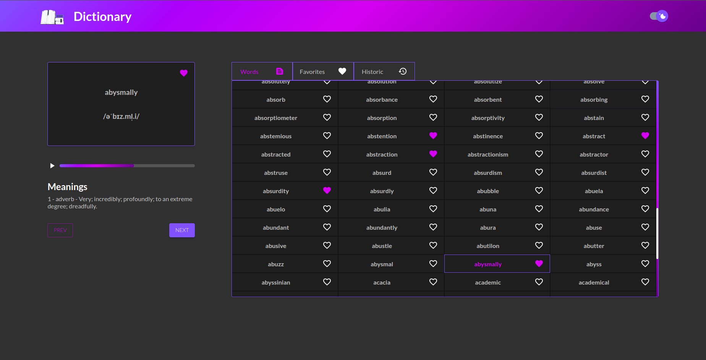
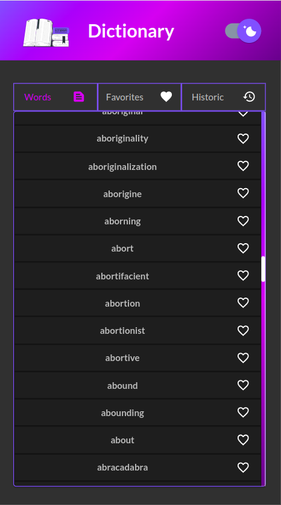
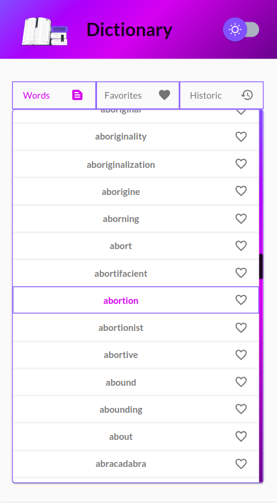
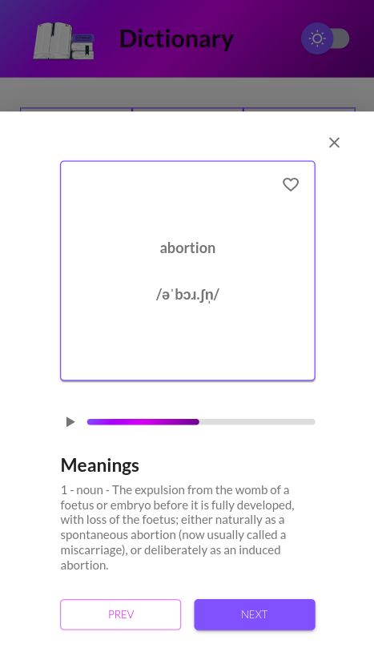

# Dictionary

  </img>
  
DASHBORD

  </img>
  </img>
  </img>
  
MOBILE

## Funcionalidades
- Vialização de uma lista de palavras em inglês
- Listagem com rolagem infinita
- Adiciona palavras a lista de favoritos
- Remove palavras da lista de favoritos
- Cache das palavras ja visualizadas (LocalStorage)
- Parametros de busca adicinados a URL

## Tecnologias:

### TypeScript:
- [TypeScript](https://www.typescriptlang.org/)
- Linguagem de programação que adiciona tipagem estática e alguns outros recursos a linguagem JavaScript.

### React.js:
- [React.js](https://reactjs.org/)
- Biblioteca JavaScript para criação de interfaces de usuário.

### Material-ui:
- [Material-ui](https://material-ui.com/)
- Biblioteca de componentes React para a construção de interfaces de usuário baseadas em Material Design.

### Styled-components:
- [Styled-components](https://styled-components.com/)
- Biblioteca utilizada para a criação de estilos.

### Axios:
- [Axios](https://axios-http.com/docs/intro)
- Biblioteca utilizada para a requisição de dados.

### React-router-dom:
- [React-router-dom](https://github.com/remix-run/react-router)
- Biblioteca utilizada para a navegação entre as páginas.

### Redux:
- [Redux](https://redux.js.org/)
- [React Redux](https://react-redux.js.org/)
- Utilizado para gerenciar o estado da aplicação.

### Prettier e Eslint:
- [Prettier](https://prettier.io/)
- [Eslint](https://eslint.org/)
- Bibliotecas utilizadas para padronização de código.

### Desafio proposto pela [Coodesh](https://coodesh.com/)
### Video Apresentação do projeto [video](https://www.loom.com/embed/ceb20165c11e4f689715701dca0c4c4d)

## API LOCAL (BACK-END):

  Foi criada outro projeto com a api em node.js, para que a aplicação possa ser executada localmente.
  O projeto e sua instruções de execução estão disponíveis no link abaixo:

### [Api Dictionary](https://github.com/devsergionunes/api-dictionary)

## INICIANDO O PROJETO:

### `EXECUTANDO O PROJETO BACK-END ANTES DE INICIAR O FRONT-END`
clone o projeto:

<pre>
  git clone https://github.com/devsergionunes/dictionary.git
</pre>

Iniciar aplicação:

<pre>
 npm install && npm start
</pre>